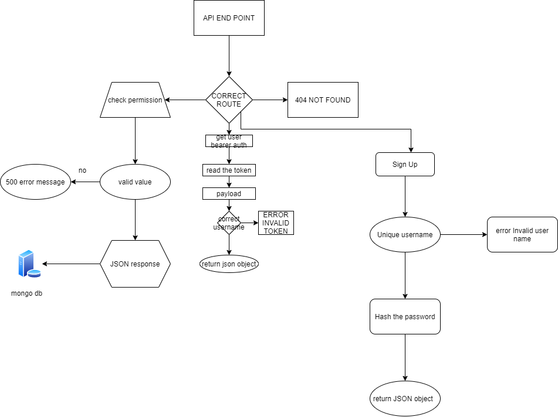

# auth-api

Role Based Access Control (RBAC) using an Access Control List (ACL), allowing to not only restrict access to routes for valid users,
Authentication Server Phase 2: Token (Bearer) Authentication

[](https://www.npmjs.com/package/npm) [](http://makeapullrequest.com) 

## Tests & Deployment

[Workflow Actions](https://github.com/ibrahimBanat/auth-api/actions)\
[deployment](https://auth-api-ibrahim.herokuapp.com//)

to start the test run:

```sell
npm test
```

## Installing / Getting started

A quick introduction of the minimal setup you need to get a hello world up &
running.

```shell
git clone git@github.com:ibrahimBanat/api-server.git
```

then change directory to:

```shell
cd api-server
```

install dependancies:

```shell
npm install
```

you should have [MongoDB](https://www.mongodb.com/cloud/atlas/lp/try2?utm_source=google&utm_campaign=gs_footprint_row_search_core_brand_atlas_desktop&utm_term=mongodb&utm_medium=cpc_paid_search&utm_ad=e&utm_ad_campaign_id=12212624584&gclid=Cj0KCQjw7pKFBhDUARIsAFUoMDaTnJoj_iQtmpKu72lEvyHV9FjKr4BRbK-2UAGpJA7LI0aBgzkBx6gaAlDQEALw_wcB) installed in your machine, and start your DB using the command: it should give you `ok` status.

```shell
sudo service mongodb start
```

you should create `.env` file and add the mongo db connection string: it should look this

```shell
MONGOOSE_URI = mongodb://localhost:27017/data
```

last thing, use `npm start` to start the application.

## Files Structure

```bash
   .
├── LICENSE
├── README.md
├── __tests__
│   └── api-v2.test.js
├── index.js
├── package-lock.json
├── package.json
└── src
    ├── auth
    │   ├── middleware
    │   │   ├── acl.js
    │   │   ├── basic.js
    │   │   └── bearer.js
    │   ├── models
    │   │   └── users.js
    │   └── routes.js
    ├── error-handlers
    │   ├── 404.js
    │   └── 500.js
    ├── middleware
    │   └── logger.js
    ├── models
    │   ├── clothes
    │   │   └── model.js
    │   ├── data-collection.js
    │   └── food
    │       └── model.js
    ├── routes
    │   ├── v1.js
    │   └── v2.js
    └── server.js
```

## UML Diagram


